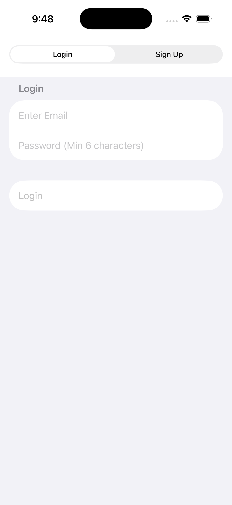
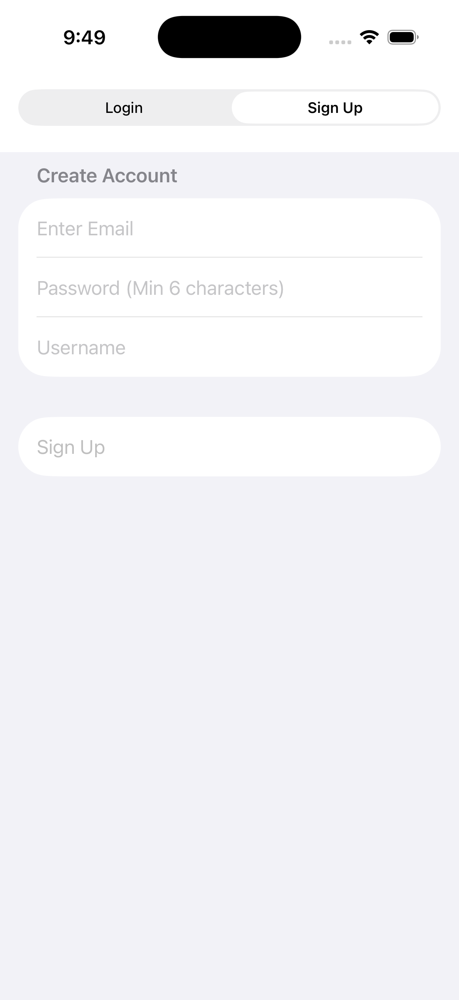
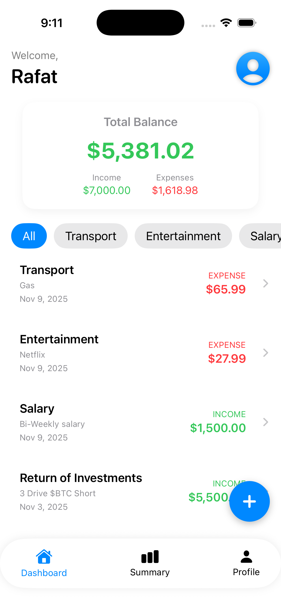
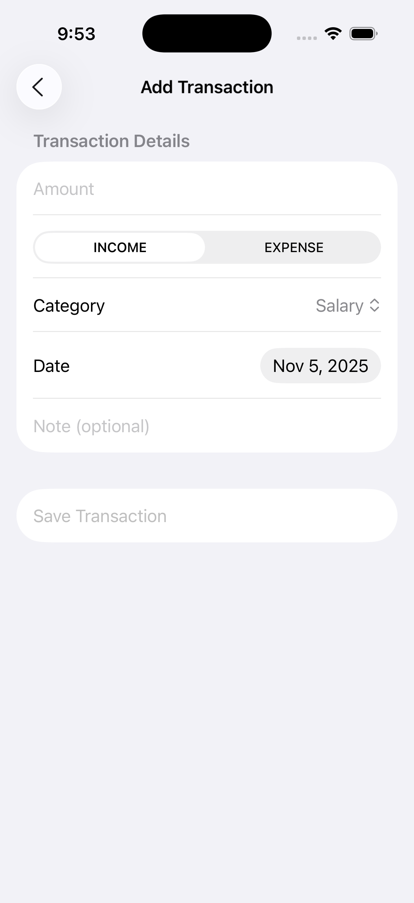
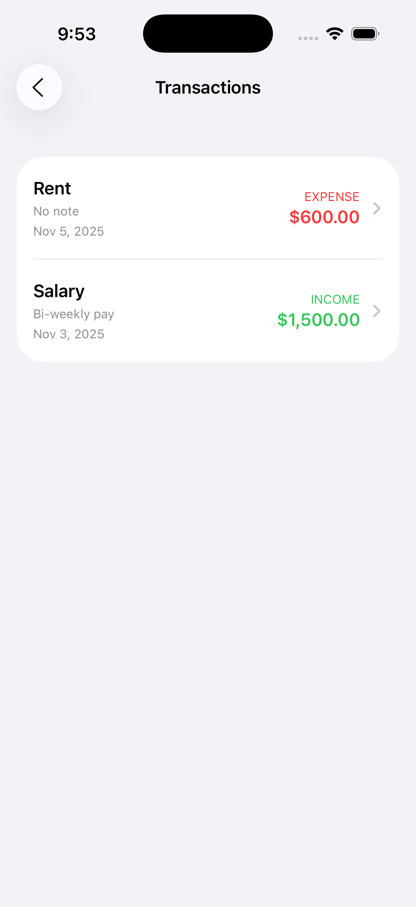
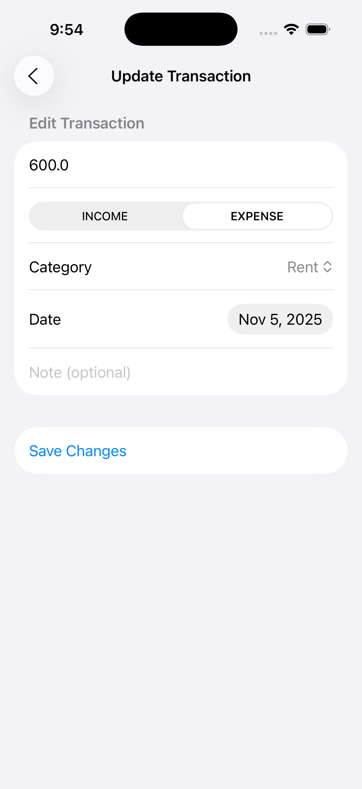
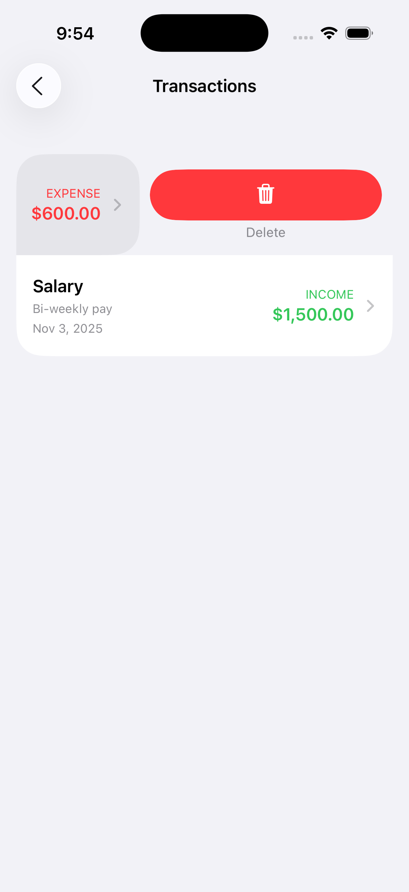

# Expense Tracker App
### Track Your Income and Expenses with Ease - iOS App with Firebase Integration

## About This Project

The **Expense Tracker App** is a native iOS application built with SwiftUI that helps users manage their personal finances efficiently. Users can securely create accounts, log transactions, and monitor their spending habits with real-time data synchronization through Firebase.

This project was developed as part of the **iOS App Development 1** course at LaSalle College, demonstrating proficiency in SwiftUI, Firebase integration, MVVM architecture, and mobile app development best practices.

## Features

- **Secure Authentication** - User registration and login with Firebase Authentication
- **Add Transactions** - Record income and expenses with custom categories
- **View Transactions** - Browse all transactions in an organized list
- **Edit Transactions** - Update transaction details with ease
- **Delete Transactions** - Swipe to remove unwanted entries
- **Real-Time Balance** - Dashboard displays current balance calculated from all transactions
- **Income & Expense Tracking** - Separate totals for income and expenses
- **Pull to Refresh** - Update transaction data instantly
- **Dynamic Categories** - Different categories for income (Salary, Investments) and expenses (Rent, Food, Bills, etc.)

## Screenshots

### Authentication
| Login Screen | Register Screen |
|--------------|-----------------|
|  |  |

### Main Features
| Dashboard | Add Transaction | Transaction List |
|-----------|----------------|------------------|
|  |  |  |

### Transaction Management
| Edit Transaction | Delete Transaction |
|-----------------|-------------------|
|  |  |

## Technologies Used

- **Language:** Swift
- **Framework:** SwiftUI
- **Architecture:** MVVM (Model-View-ViewModel)
- **Backend:** Firebase
  - Firebase Authentication
  - Firebase Firestore
  - Firebase Core
- **Development Environment:** Xcode 26.0.1

## Installation

### Prerequisites
- macOS with Xcode 26.0.1 or later
- Firebase account

### Setup Instructions

1. **Clone the repository**
```bash
git clone https://github.com/Rafat-i/Expense-Tracker-App.git
cd Expense-Tracker-App
```

2. **Open in Xcode**
```bash
open "Expense Tracker App.xcodeproj"
```

3. **Configure Firebase**
   - Create a Firebase project at [Firebase Console](https://console.firebase.google.com/)
   - Add an iOS app to your Firebase project
   - Download `GoogleService-Info.plist`
   - Add the file to your Xcode project

4. **Install Dependencies**
   - Firebase libraries are already configured in the project
   - Ensure you have:
     - FirebaseAuth
     - FirebaseFirestore
     - FirebaseCore

5. **Build and Run**
   - Select your target device/simulator
   - Press `Cmd + R` or click the Run button

## Usage

### For End Users

1. **Create an Account**
   - Open the app
   - Tap "Sign Up"
   - Enter email, password, and username
   - Tap "Sign Up" to create your account

2. **Add a Transaction**
   - Login to your account
   - Tap "Add Transaction" on the dashboard
   - Enter amount, select type (Income/Expense)
   - Choose a category
   - Add an optional note
   - Tap "Save Transaction"

3. **View Your Balance**
   - Dashboard displays your current balance
   - See total income and expenses at a glance

4. **Manage Transactions**
   - Tap "View Transactions" to see all entries
   - Tap a transaction to edit it
   - Swipe left to delete a transaction

## Team Contributions

This project was developed by:

- **Rafat & Kevin**
  - Firebase setup and integration
  - Authentication system (login/register)
  - Transaction CRUD operations
  - Dashboard with real-time data
  - UI/UX design and implementation
  - UML diagrams (Flowchart, Class, Activity, ER)

## Project Structure
```
Expense Tracker App/
├── Models/
│   ├── UserModel.swift                # User data model
│   └── TransactionModel.swift         # Transaction data model
├── Services/
│   ├── AuthService.swift              # Authentication logic
│   └── TransactionService.swift       # Transaction CRUD operations
├── Views/
│   ├── AuthGate.swift                 # Login/Register toggle
│   ├── LoginView.swift                # Login screen
│   ├── RegisterView.swift             # Registration screen
│   ├── DashboardView.swift            # Main dashboard
│   ├── AddTransactionView.swift       # Add transaction form
│   ├── TransactionListView.swift      # Transaction list
│   ├── UpdateTransactionView.swift    # Edit transaction form
│   └── SummaryView.swift              # Summary statistics
├── Validators.swift                   # Input validation utilities
└── ContentView.swift                  # Root view with auth check
```

## Known Issues

- Index requirement for Firebase queries when sorting by date (resolved by sorting in-app)
- No offline mode - requires internet connection
- Summary view is currently a placeholder (planned for future release)

## What I Learned

Through this project, I gained experience in:
- Building iOS apps with SwiftUI
- Implementing MVVM architecture pattern
- Integrating Firebase for backend services
- Working with Firestore for real-time data
- Handling user authentication and data security

## Future Enhancements

- Summary view with charts and graphs
- Category-based filtering
- Budget & investment goals

## License

This project was created for educational purposes as part of the iOS App Development 1 course at LaSalle College.
